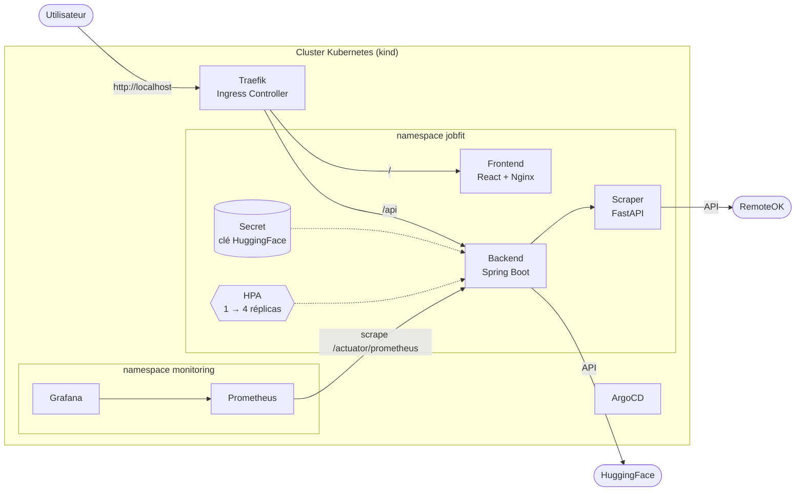
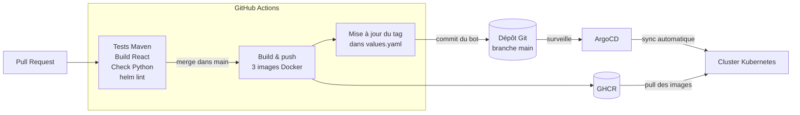

# JobFit Assistant — Plateforme IA en microservices déployée sur Kubernetes


JobFit Assistant analyse un CV avec l'IA (HuggingFace) et le compare à des offres d'emploi récupérées en temps réel.

Ce dépôt montre surtout **comment l'application est industrialisée** : conteneurisation, orchestration Kubernetes, packaging Helm, CI/CD, GitOps, observabilité et Infrastructure as Code. Toute la plateforme se reconstruit de zéro avec **une seule commande**.

---

## Architecture



| Service | Technologie | Rôle |
|---|---|---|
| `frontend` | React (Vite) servi par Nginx | Interface utilisateur |
| `backend` | Spring Boot 3 (Java 21) | API, extraction du PDF, appel à l'IA |
| `scraper` | FastAPI (Python 3.12) | Récupération des offres d'emploi |

---

## Pipeline CI/CD et GitOps

Du `git merge` jusqu'au déploiement, **sans aucune intervention manuelle** :



- **CI** : chaque Pull Request lance 4 jobs en parallèle (tests backend, build frontend, vérification du scraper, `helm lint`).
- **CD** : après fusion, les 3 images sont publiées sur GitHub Container Registry, taguées avec le **SHA du commit** (traçabilité exacte de la version déployée).
- **GitOps** : un job met à jour les tags dans le chart Helm et commit (`[skip ci]` pour éviter une boucle). ArgoCD détecte le changement et déploie.
- **Self-heal** : toute modification manuelle du cluster est automatiquement annulée par ArgoCD. Git reste la seule source de vérité.

---

## Stack DevOps

| Domaine | Outils |
|---|---|
| Conteneurs | Docker (multi-stage, utilisateurs non-root), Docker Compose |
| Orchestration | Kubernetes (kind), Deployments, Services, Ingress, Secrets, probes |
| Packaging | Helm (chart maison : templates, `values.yaml`, HPA, ServiceMonitor, dashboard) |
| Ingress | Traefik |
| CI/CD | GitHub Actions, GitHub Container Registry |
| GitOps | ArgoCD (sync automatique, prune, self-heal) |
| Observabilité | Prometheus, Grafana, Micrometer, kube-prometheus-stack |
| Infrastructure as Code | Terraform (providers kind, helm, kubernetes) |

---

## Démarrage rapide

### Prérequis

Docker Desktop (6 Go de mémoire minimum), Terraform, kubectl et Helm.

### 1. Fournir la clé HuggingFace

Créer `terraform/terraform.tfvars` (ignoré par Git) :

```hcl
huggingface_api_key = "hf_..."
```

### 2. Tout créer

```bash
cd terraform
terraform init
terraform apply
```

Terraform crée le cluster kind, installe Traefik, metrics-server, Prometheus/Grafana et ArgoCD, crée le Secret, puis déclare l'Application ArgoCD. ArgoCD déploie ensuite l'application depuis ce dépôt.

L'application est disponible sur **http://localhost**.

### 3. Accéder aux outils

```bash
# ArgoCD → https://localhost:8443 (utilisateur : admin)
kubectl port-forward service/argocd-server -n argocd 8443:443

# Grafana → http://localhost:3000 (utilisateur : admin), dashboard « JobFit Assistant »
kubectl port-forward service/monitoring-grafana -n monitoring 3000:80

# Prometheus → http://localhost:9090
kubectl port-forward service/monitoring-kube-prometheus-prometheus -n monitoring 9090:9090
```

### Développement local sans Kubernetes

```bash
# Créer un fichier .env à la racine avec HUGGINGFACE_API_KEY=hf_...
docker compose up --build
# → http://localhost:3000
```

---

## Observabilité

Le backend expose ses métriques via Spring Boot Actuator et Micrometer. Un **ServiceMonitor** (dans le chart Helm) indique à Prometheus où les collecter.

Le dashboard Grafana est **versionné dans Git** (`helm/jobfit/dashboards/jobfit.json`) et déployé par ArgoCD sous forme de ConfigMap. Il affiche :

- requêtes par seconde, par route (hors routes techniques `/actuator`)
- **latence p95** par route
- taux d'erreurs 5xx
- mémoire JVM, CPU et mémoire par pod

---

## Problèmes rencontrés et résolus

Ce projet m'a confronté à de vrais problèmes de production. Voici comment je les ai diagnostiqués.

**Erreur 403 invisible sur l'upload de CV (Docker Compose).** Aucune trace dans les logs du backend. Les logs Nginx ont montré le code 403 : Nginx transmettait le header `Host` sans le port, donc Spring voyait une requête cross-origin et la rejetait (CORS). Corrigé en passant `$http_host` au lieu de `$host`.

**Autoscaling déclenché au démarrage de Java.** Le pic CPU du démarrage de la JVM dépassait le seuil du HPA (70 %), qui montait à 4 réplicas sans charge réelle. Repéré grâce aux dashboards Grafana. Pistes : augmenter les `requests` CPU ou configurer `behavior.scaleUp.stabilizationWindowSeconds`.

**Latence p95 de ~1,7 s sur la recherche d'offres.** Le dashboard a montré que cette latence venait de l'appel à l'API externe RemoteOK, fait à chaque requête. Piste d'amélioration : un cache de quelques minutes.

**Terraform bloqué 10 minutes sur Traefik.** Le Service restait en `LoadBalancer` avec une IP `<pending>` (aucun load balancer sur kind), et Helm attendait indéfiniment. Cause : dans la version 41 du chart, la clé est `service.spec.type` et non `service.type`, qui était ignorée **sans erreur**. Leçon : toujours vérifier les clés avec `helm show values <chart> --version <x>`.

**ArgoCD ne déployait rien (`ComparisonError`).** Le `repo-server` redémarrait en boucle : sa liveness probe avait un délai d'1 seconde, trop court sur une machine chargée. Corrigé dans Terraform en augmentant `timeoutSeconds`.

**Ingress affiché en « Progressing » dans ArgoCD.** Traefik ne publiait aucune adresse sur l'Ingress. Corrigé avec `--providers.kubernetesingress.ingressendpoint.ip`. En chemin, le rolling update de Traefik se bloquait à cause des `hostPort` (deux pods ne peuvent pas prendre le même port) : corrigé avec `maxSurge: 0`.

**Fin de vie d'ingress-nginx.** Le projet utilise Traefik plutôt qu'ingress-nginx, retiré en mars 2026 et qui ne reçoit plus de correctifs de sécurité.

---

## Sécurité

- Aucun secret dans Git : la clé HuggingFace passe par un Secret Kubernetes, créé par Terraform à partir d'une variable `sensitive`.
- `.env`, `terraform.tfvars`, `*.tfstate` et le kubeconfig sont exclus par `.gitignore`.
- Les conteneurs tournent sans les droits root.
- Les images sont taguées par SHA de commit, jamais déployées en `latest`.

---

## Structure du dépôt

```
.
├── backend-service/        # Spring Boot + Dockerfile multi-stage
├── frontend-service/       # React + Nginx + Dockerfile multi-stage
├── scraper-service/        # FastAPI + Dockerfile
├── helm/jobfit/            # Chart Helm de l'application
│   ├── templates/          # Deployments, Services, Ingress, HPA, ServiceMonitor, dashboard
│   ├── dashboards/         # Dashboard Grafana (JSON)
│   └── values.yaml         # Configuration (tags d'images mis à jour par la CI)
├── terraform/              # Infrastructure as Code : cluster + plateforme + Application ArgoCD
├── .github/workflows/      # Pipeline CI/CD
└── docker-compose.yml      # Lancement local sans Kubernetes
```
